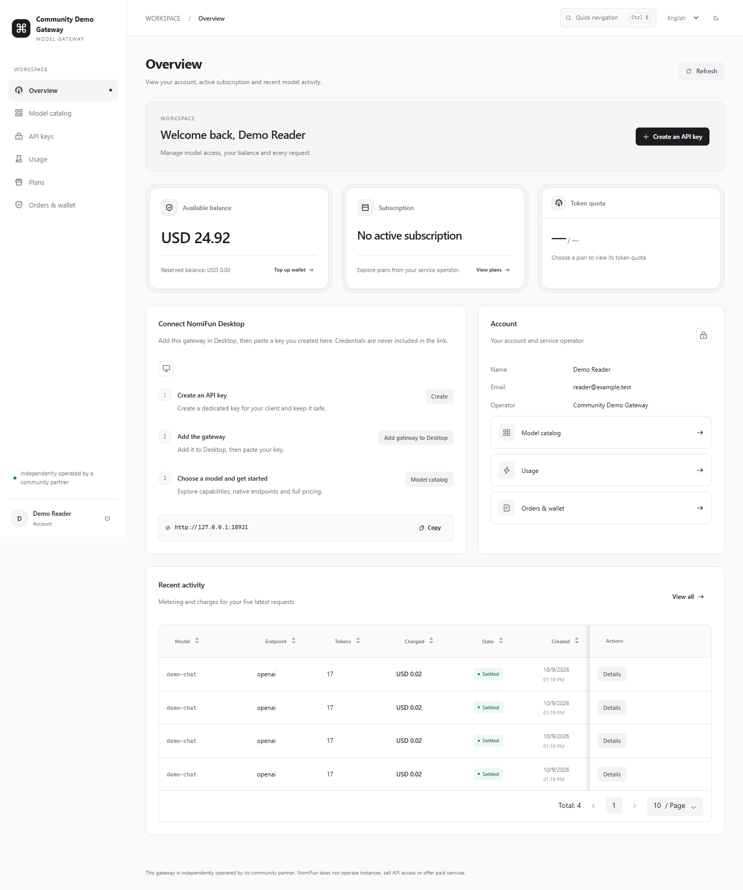
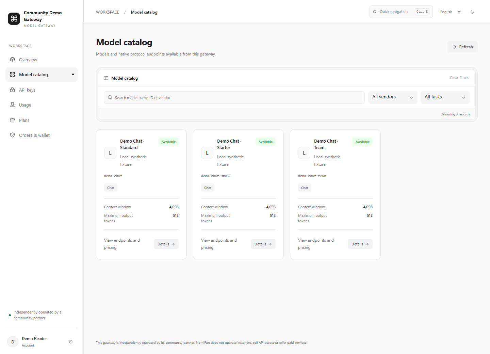
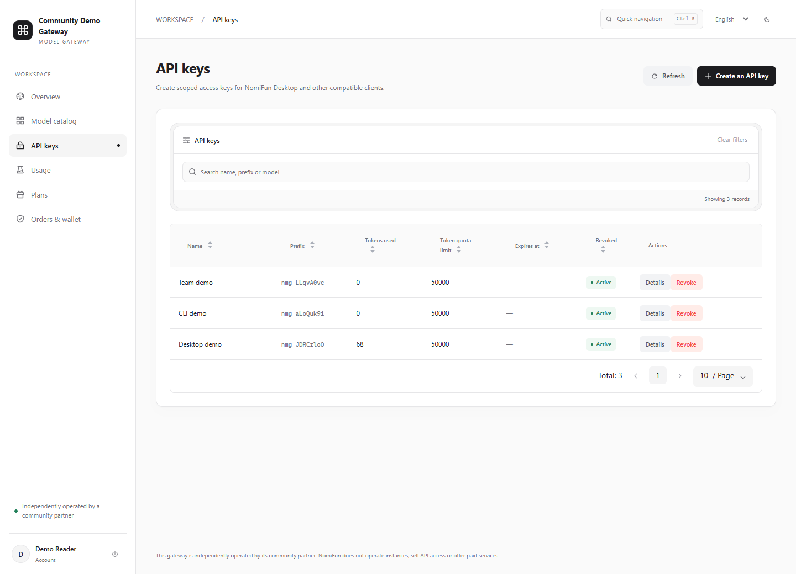
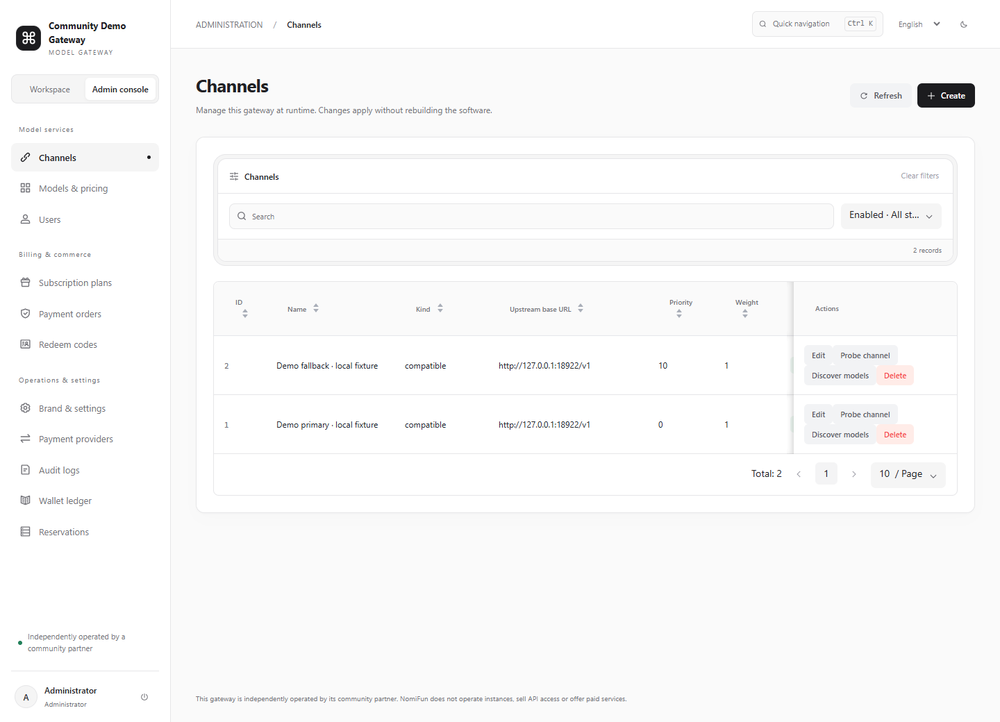
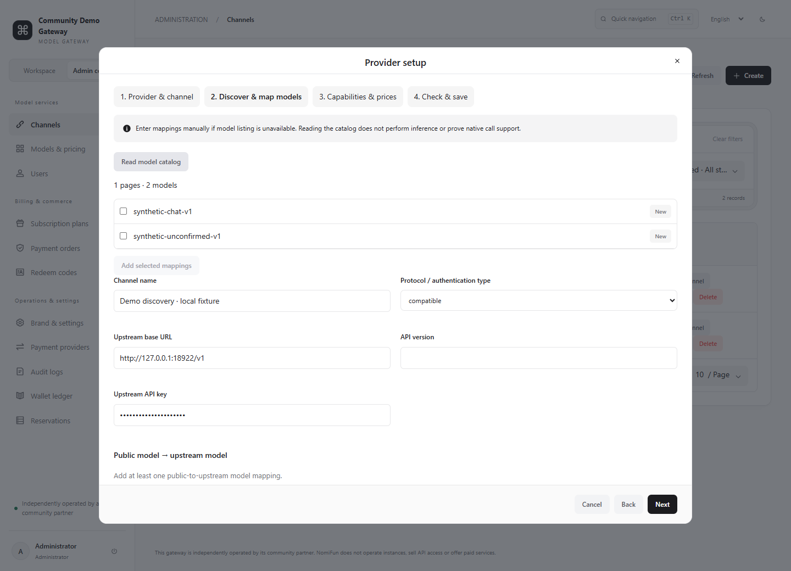

# Model Gateway console

English | [简体中文](README.zh-CN.md)

This React/TypeScript application is the user workspace and administrator console
for `nomifun-model-gateway`. It uses Arco Design, UnoCSS and i18next, and reads the
running gateway's API. There is no sample-data fallback when an API request fails.
The Go gateway serves the compiled console at `/console/` and its internal
account API at `/api/console/v1`.

Each deployed gateway is independently operated by its community partner.
**NomiFun does not operate gateway instances, sell API access or offer paid
services.** Contact the operator shown in your console for account, model,
payment and support questions.

For gateway installation and API examples, start with the [project README](../README.md).
The [public v1 protocol](../docs/protocol/v1.md) and [OpenAPI contract](../openapi.yaml)
define client integration; the console's internal account API is a separate surface.

## Product screenshots

These screenshots show the actual local console with synthetic example account,
catalog and billing records. They contain no real credentials or customer data.
They demonstrate the interface, and do not establish real upstream inference,
merchant payment acceptance or production readiness. Your operator's name,
models, prices, balance and available actions will differ.
See the [screenshot capture notes](../docs/screenshots/README.md) for the local
fixture, capture scope and refresh procedure.

**Account overview:** balance, subscription quota, connection steps and recent usage.



**Model catalog:** search models and inspect the operator's declared tasks and limits.



**API keys:** view key prefixes, quotas and expiry, and create or revoke client access.



**Administrator channels:** manage upstream routing and run separate probe/discovery actions.



**Provider setup:** select a provider, enter its connection details and continue to mapping and pricing.



## Sign in and navigate

1. Open your operator's gateway origin followed by `/console/`.
2. Sign in with your account email and password. Registration is disabled by
   default. **Create account** is available only after the operator enables it;
   otherwise contact the operator.
3. Use the sidebar for the six user pages. Administrators can switch between
   **Workspace** and **Admin console**; ordinary users do not receive administrator navigation.
4. Use **Quick navigation**, or **Ctrl+K / Cmd+K**, to search page names and choose
   a destination. The URL hash retains the destination across reloads and browser
   back/forward navigation. The shortcut does not replace an open editor.
5. Switch between English and 简体中文 in the top bar. Language is remembered in
   `localStorage`. The light/dark theme lasts for the current page session.
6. On narrow screens, open the navigation drawer and scroll wide tables horizontally.
   Tables support sorting and pagination; search and status filters narrow the
   records already loaded. **Refresh** reads current API data.

The account session bearer is stored in `sessionStorage`, separately from inference
API keys. **Sign out** attempts to revoke the server session, then clears the local
bearer. A 401 clears the local session and asks you to sign in again. If an API
request fails, use the displayed retry action or contact the operator; the console
does not replace missing data with sample results.

## User workflow

Start by inspecting **Model catalog**, then create a dedicated key for your client.
If the account has insufficient balance or requires a subscription, use the
operator's enabled recharge, plan or redemption option before calling a model.

| Page | What to do |
| --- | --- |
| **Overview** | Check available and reserved balance, the active subscription, quota and five recent requests. Create a key, copy the gateway origin, or use **Add gateway to Desktop**. |
| **Model catalog** | Search by name, public ID or vendor; filter by vendor and task. Open **Details** for native endpoints, preferred endpoint, pricing and metadata. A catalog ID is the ID to use in your client. |
| **API keys** | Create a named key with optional ISO 8601 expiry. Expand **Advanced settings** to set total token quota, allowed model IDs, IP/CIDR restrictions, requests/minute, tokens/minute and concurrency. Comma-separated model/IP lists are accepted. Blank optional limits mean no additional key limit; account and model policies still apply. Inspect details or confirm **Revoke** to stop that key's access. |
| **Usage** | Search by request ID, model or endpoint, and filter by reservation state. Inspect actual tokens and charge details. These records contain metering, not prompt or response content. |
| **Plans** | Compare price, period, token quota and model restrictions. Choose **Buy plan**, select an enabled payment provider, and create checkout. Purchase is unavailable when no payment provider is enabled. |
| **Orders & wallet** | Choose **Top up wallet**, enter an integer amount, select a provider and create checkout. Open order details to continue secure checkout or refresh status. Enter a redeem code to receive its wallet credit or plan once. |

After key creation, copy the full key from **Shown once only** before closing the
dialog. The server retains its hash and prefix; you cannot recover the full key
from the list. If you lose it, create a replacement and revoke the old key.
If clipboard access fails, select and copy the text manually. Do not include it
in screenshots, issue reports or URLs.

**Add gateway to Desktop** opens a `nomifun://add-provider` link with the gateway
origin and operator name. Confirm the operator in Desktop, then paste your key
there; the link never includes credentials. If your system does not open the link,
add a NomiFun Model Gateway provider manually in Desktop with the gateway origin
and your key. Use the public origin of the actual
gateway for other compatible clients and follow the [integration guide](../docs/partners/integration.md).
The Vite development address is for UI development; use the backend origin for
inference clients rather than copying the development frontend origin.

Order details can open credential-free HTTPS checkout links. Official WeChat
Native and supported Alipay QR checkout URLs render as QR images. Completing a
browser checkout page is not proof of credit: refresh the order and confirm
the verified `paid` state and account balance. Contact the operator for unresolved orders.

## Administrator workflow

For a new instance, sign in with the administrator account created during gateway
bootstrap. Configure **Brand & settings**, then add channels and models, verify
their configuration, and set account access or subscription plans. Payments remain
disabled until the operator supplies and validates official merchant configuration.
See [deployment](../docs/operations/deployment.md) for administrator bootstrap and
[operator responsibilities](../docs/compliance/operator-checklist.md) before release.

| Page | What to do |
| --- | --- |
| **Channels** | Create a channel through provider setup; edit operational fields and mappings; probe the connection; discover upstream model IDs; or confirm channel deletion. A probe and discovery are separate from inference acceptance. |
| **Models & pricing** | Create or edit a public model's capabilities, task endpoints, preferred route, limits and selling prices. Run publication checks before enabling it. The row's **Disabled** action disables a model after confirmation. |
| **Users** | Edit administrator/disabled status. Use **Credit wallet** with a positive integer amount, currency and reason; the adjustment is recorded in the ledger and audit log. This page has no account-create or password-reset action. |
| **Subscription plans** | Create or edit name, price, currency, positive period in days, optional token quota and public model IDs. Decide whether the plan is enabled. |
| **Payment orders** | Inspect orders and details. For a pending order, **Reconcile** queries the official provider and applies a verified result idempotently. |
| **Redeem codes** | Create codes with wallet amount/currency, optional plan ID, count and expiry. Copy the generated codes from their one-time dialog. Filter used/unused codes; only unused codes can be deleted. |
| **Brand & settings** | Edit the independent operator's name and HTTPS homepage/console/purchase/terms/privacy links, registration policy, default currency and declared capabilities. Keep optional endpoints empty in this release. Changing the default currency affects new accounts; existing accounts keep their currency. |
| **Payment providers** | Configure Stripe, Alipay or WeChat using official merchant credentials. Check presence indicators and enabled/environment status. Blank credential fields keep the stored value. Resolve pending orders before changing merchant identity or credentials. |
| **Audit logs** | Search administrative/security actions and inspect records; raw credentials and model content are excluded. |
| **Wallet ledger** | Review wallet credits, request settlement and resulting balances; inspect details and correlate by request ID. |
| **Reservations** | Inspect `reserved` or `reconciliation` requests. Reconcile with a reason and verified usage JSON to **Settle**, or **Release** only after confirming that the upstream did not accept/charge the request. |

Use the [request/payment reconciliation procedure](../docs/operations/reconciliation.md)
for interrupted requests and pending orders. Stripe/Alipay test modes and WeChat
production merchant transactions need their own external acceptance; local
signature, callback and UI tests do not replace those checks.

### Add a provider, map models and publish

1. In **Channels → Create**, choose a provider preset or **Custom**. Enter a
   descriptive name, protocol/authentication type, actual upstream base URL and
   API key. Presets fill connection fields only. Replace every `YOUR-*` placeholder,
   keep required product prefixes, and omit the `/v1` suffix that the gateway
   appends. Check [provider presets](../docs/operations/provider-presets.md) for
   Azure deployment names, regional products and API-version rules.
2. In **Discover & map models**, read the upstream catalog if its list API is
   available, or add mappings manually. The left ID is your public model ID and
   the right ID is the upstream model/deployment. Select returned entries and
   choose **Add selected mappings**. Review partial-catalog warnings, conflicting
   public IDs and preserved mapping differences. Discovery does not replace
   mappings or derive capabilities, account access or selling prices.
3. In **Capabilities & prices**, configure every new public model. Supply its
   display name and vendor, add tasks, choose confirmed native endpoints per
   task, and select a preferred endpoint from those choices. Enter only confirmed
   context/output limits. An Anthropic preferred endpoint requires a positive
   maximum output-token limit. Input modalities and traits are descriptions;
   they do not activate protocol features.
4. Add pricing rows with task, meter, unit size, integer amount and three-letter
   uppercase currency. Each enabled task needs prices compatible with this
   deployment's billing support and instance currency. Use one currency per model;
   do not price both cache-read aliases. Missing prices are unconfigured; enter
   `0` only when intentionally offering free usage. Leave incomplete models disabled.
5. In **Check & save**, run **Run publication checks**, inspect every issue and
   correct the draft. Enabled chat models need positive context/output limits,
   a supported route through an enabled credentialed channel, and complete
   pricing; subscription-only models also need an enabled plan covering them.
   **Save configuration** creates the channel and new models in one transaction.
   A public-ID conflict rolls back creation. Checks inspect configuration and
   routes; they do not invoke the upstream.

For an existing channel, **Discover models** uses its stored sealed credential.
Review and select entries, choose **Add selected mappings**, then explicitly save
the mapping changes. Create or edit the corresponding public models separately;
new mappings do not publish catalog models by themselves. Channel protocol,
upstream URL, API version and credential form immutable account identity: create
a new channel to change them. Edit name, mappings, endpoints, priority, weight and
enabled status through the existing channel editor. Higher priority is preferred;
weight selects among channels of equal priority. Before removing a final declared
route, supply a replacement or disable the affected model.

Channel/model editors provide visible fields and optional **Advanced JSON**.
Apply or discard pending JSON edits before editing visible fields or saving.
Unknown fields and exact integers survive a visual edit. If a save reports an
unknown outcome, close the dialog and refresh channels/models to confirm the
result before trying again; repeated submission is locked to avoid duplicates.
Cancelling provider setup saves no draft or credential.

## Amounts and credentials

Money fields use **integer minor currency units**, not decimal major units:
`100` means USD 1.00 or CNY 1.00; `1000` means USD 10.00 or CNY 10.00.
For a pricing row, `amount` applies to `unit_size` units of its meter; for example,
`amount=2`, `unit_size=1000`, `meter=input_tokens`, `currency=USD` declares
USD 0.02 per 1,000 input tokens. This is an illustrative configuration, not an
advertised price. Actual charges combine applicable pricing rows and round each
row upward to minor units. Currency formatting uses that currency's fraction digits.
Token quotas are integers in tokens, separate from wallet amounts.

Native `bigint` and `json-bigint` preserve int64 values throughout JSON handling,
including IDs and money beyond JavaScript's safe integer range. Enter whole
integers without decimal or exponent notation.

API keys and redeem codes appear once in memory only. Upstream and merchant
credentials are write-only; payment forms show presence rather than secret
values. The browser persists the account bearer in `sessionStorage` and language
preference in `localStorage`; it does not persist these one-time secrets.

## Local frontend development

Use the Go version pinned in [go.mod](../go.mod) (Go 1.27.1) and **Node.js 24 or later**.
The backend must be configured and running; the protocol mock on port 8788 does
not implement the account console API.

1. Follow the [root quick start](../README.md) or
   [deployment guide](../docs/operations/deployment.md): set your master key,
   database and first administrator credentials in the process environment.
   The Go process does not automatically read `.env`. First-start administrator
   email/password must be set together before initializing an empty database;
   passwords are 12–72 bytes. These settings do not reset/promote an existing account.
2. In a repository-root terminal, start the real backend:

   ```sh
   go run ./cmd/model-gateway
   ```

3. In a second terminal, start the frontend:

   ```sh
   cd console
   npm ci --ignore-scripts
   npm run dev
   ```

4. Open `http://127.0.0.1:5173/console/` and sign in to the backend account.
   Vite proxies `/api` and `/nomifun` to `http://127.0.0.1:8789` by default.
   The compiled production console is served directly at
   `http://127.0.0.1:8789/console/`.

For an isolated local backend, set `NMG_DEV_PROXY` before starting Vite:

```powershell
# In console/; the chosen backend must already listen at this origin.
$env:NMG_DEV_PROXY = 'http://127.0.0.1:18789'
npm run dev
```

```sh
# POSIX equivalent, in console/.
NMG_DEV_PROXY='http://127.0.0.1:18789' npm run dev
```

The proxy preserves the browser's Host and Origin pair for same-origin write
protection. Keep it aligned with the actual backend; do not disable origin checks
to work around a bad proxy configuration. Stop both development processes when
finished, and keep runtime databases and credentials out of source control.

## Build, validation and distribution

From `console/`:

```sh
npm ci --ignore-scripts
npm run typecheck
npm test
npm run licenses
npm run build
```

`npm run build` type-checks and bundles the application, gathers runtime license
texts into `THIRD_PARTY_LICENSES.txt`, and copies the result from `console/dist`
to **`internal/console/assets`** for `go:embed`. Embedded assets are tracked and
required for a Go-only build. Include their changes when shipping a frontend
change; `console/dist` and `node_modules` are rebuildable outputs.

After frontend checks, run the repository's local Go/license validation from its root:

```sh
go test ./...
go vet ./...
go build ./...
bash scripts/check-licenses.sh
node --test scripts/check-frontend-licenses.test.mjs
```

On Windows, replace the Bash license command with
`pwsh -NoProfile -File scripts/check-licenses.ps1`. The policy audits direct,
development, optional and transitive dependencies and rejects unknown or
unapproved licenses. Keep bundled frontend notices and Go publisher notices
with binary/container distributions; the project LICENSE alone is insufficient.
See [local acceptance](../docs/operations/acceptance.md) and
[UI validation evidence](../docs/validation/ui-redesign.md) for separate runtime checks.

### Component provenance

The console adapts eight selected components from the user-owned local
`portal/codevisual` library: StatCard, UsageMeter, StateEmpty, StateError, Toast,
Filters, CommandPalette and the configuration checklist adapted from HealthCheck.
The copyright owner explicitly authorized Apache-2.0 transplantation. Source
SHA-256 snapshots, authorization and modifications are recorded in
[provenance.json](../licenses/codevisual/provenance.json) and distributed
[frontend notices](notices/codevisual.txt). The supplied source has no Git commit;
the record does not invent one.

These components use controlled inputs, live API data, actions and keyboard
navigation. Gallery defaults, fake trends, simulated health/latency and looping
or fade-out animations were removed. Motion 13.4.6 and Lucide React 1.49.0 are
pinned and audited. Arco handles table pagination and dialog focus. No commercial
CodedVisuals source or extracted map/face assets are included. Animations respect
`prefers-reduced-motion` and light/dark themes share semantic styles.

The Vite 7 maintenance line is pinned deliberately: Vite 8 requires Lightning CSS
under MPL-2.0, which does not meet this repository's permissive-only policy.
The built-in esbuild JSX transform avoids non-allowlisted build dependencies.
See the [license audit](../docs/security/license-audit.md) for the full policy.

## Troubleshooting

| Symptom | Check or next step |
| --- | --- |
| Vite loads but sign-in or page data fails | Confirm the real backend is running and `NMG_DEV_PROXY` matches its origin. Port 8788's protocol mock has no console account API. |
| Registration is unavailable | The operator must enable registration in **Brand & settings**; contact the operator for an account. |
| Session expired | Sign in again; inference API keys are not account-login sessions. |
| No models or plans appear | Clear filters and refresh. The operator must publish eligible models/plans and grant access; an empty catalog is not replaced with examples. |
| A publication check fails | Correct the reported task/endpoint/limit/price/route or access issue; keep unfinished models disabled. |
| Discovery returns a partial list or fails | Review warnings and the provider/product/region/address. Add verified mappings manually rather than treating an incomplete list as the full catalog. |
| A write outcome is unknown | Close the editor, refresh and inspect saved state before retrying. |
| Checkout is unavailable or remains pending | Confirm an enabled merchant provider, refresh the order, then ask the operator to reconcile against the official provider. |
| Usage remains reserved or needs reconciliation | The operator must verify upstream acceptance and usage, then follow the reconciliation procedure. |
| Copying a key fails | Select and copy the one-time value manually before closing; it cannot be retrieved later. |

## Related documentation

- [Project README](../README.md) · [中文项目说明](../README.zh-CN.md)
- [Public protocol v1](../docs/protocol/v1.md) · [OpenAPI](../openapi.yaml)
- [Deployment](../docs/operations/deployment.md) · [Backup and recovery](../docs/operations/backup-and-recovery.md)
- [Provider presets](../docs/operations/provider-presets.md) · [Desktop handoff](../docs/partners/provider-onboarding-desktop-handoff.md)
- [Request and payment reconciliation](../docs/operations/reconciliation.md) · [Operator responsibilities](../docs/compliance/operator-checklist.md)
- [Partner integration](../docs/partners/integration.md) · [Local acceptance](../docs/operations/acceptance.md)
