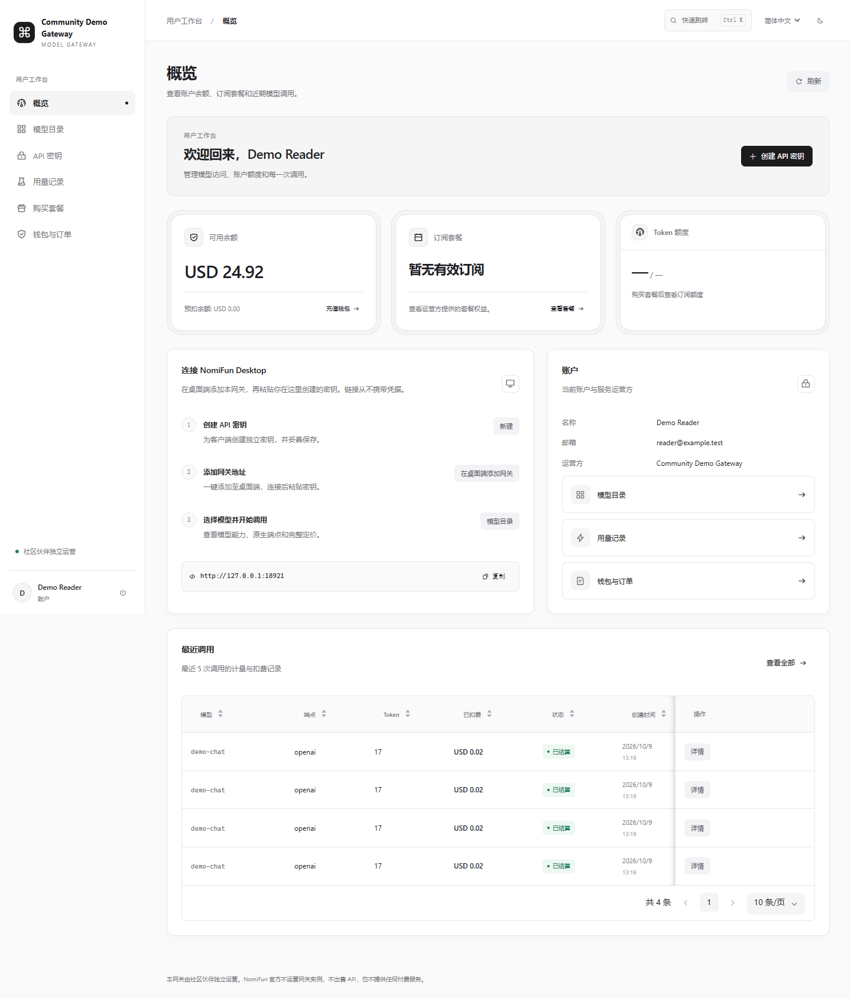
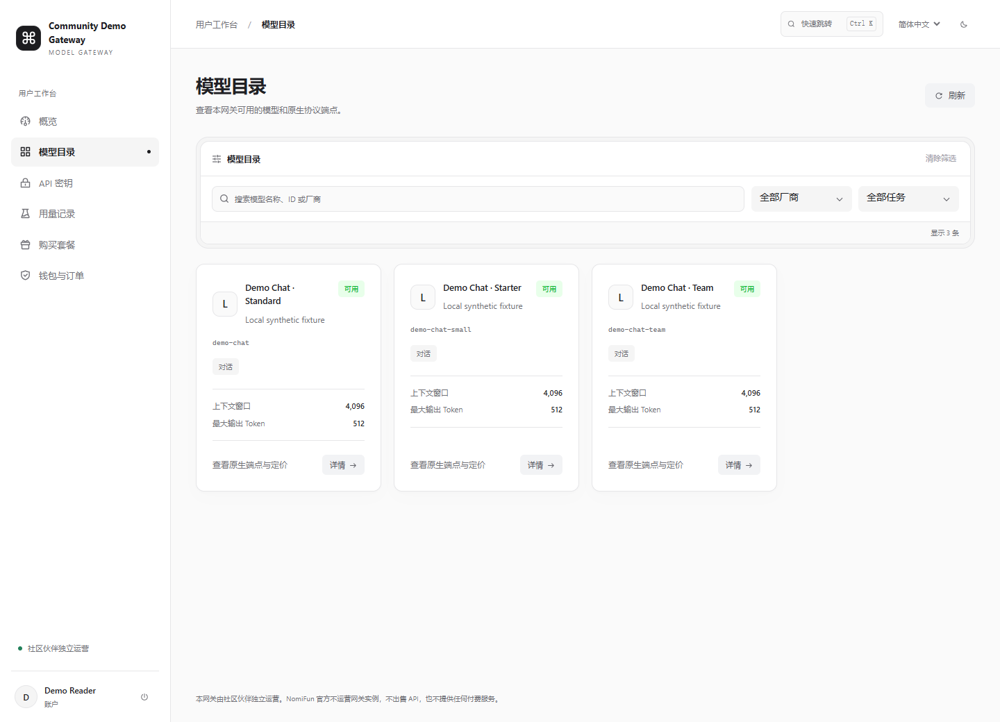
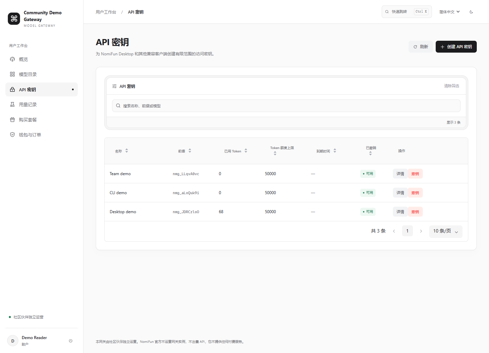
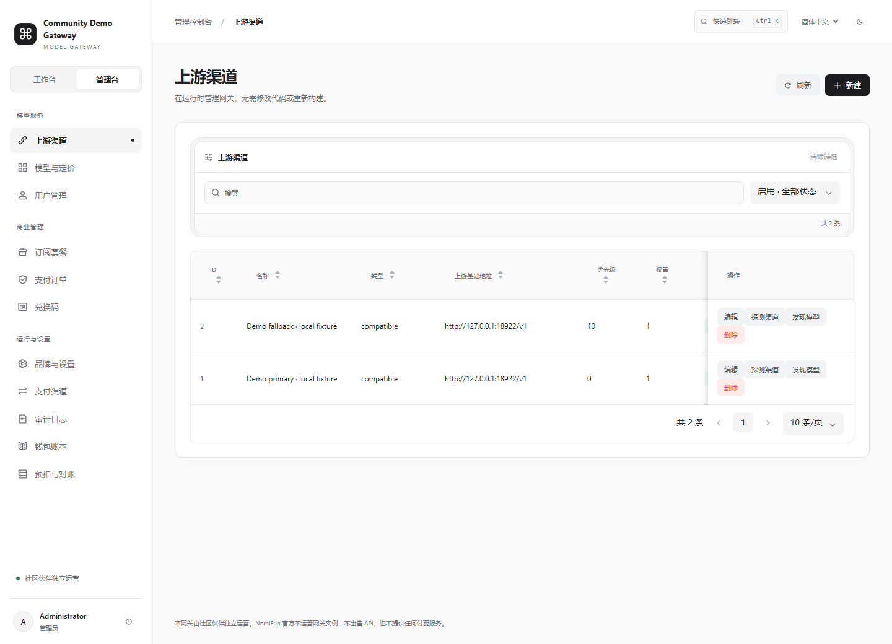
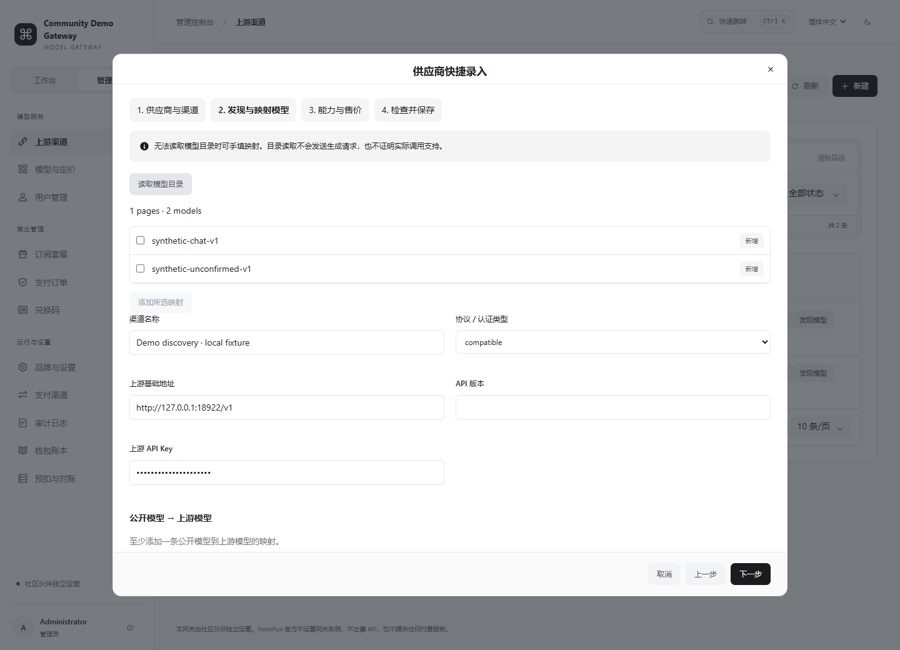

# 模型网关控制台

[English](README.md) | 简体中文

这是 `nomifun-model-gateway` 的用户工作台与管理员控制台，使用 React/TypeScript、
Arco Design、UnoCSS 和 i18next，并从运行中的网关 API 读取数据。API 请求失败时没有
示例数据回退。Go 网关在 `/console/` 提供编译后的页面，内部账户 API 前缀为
`/api/console/v1`。

每个部署的网关都由社区伙伴独立运营。**NomiFun 官方不运营网关实例、不出售 API，
也不提供付费服务。** 账户、模型、支付和售后问题，请联系控制台显示的服务运营方。

网关安装和 API 示例见[项目说明](../README.zh-CN.md)。客户端接入遵循
[公开 v1 协议](../docs/protocol/v1.md)与 [OpenAPI 合同](../openapi.yaml)；
控制台内部账户 API 是独立的管理接口。

## 产品截图

以下截图来自真实本地控制台，使用合成的示例账户、模型目录和账务记录，不含真实凭据
或客户数据。截图用于展示操作界面，不能证明真实上游推理、商户支付验收或生产就绪。
实际运营方名称、模型、售价、余额和可用操作会有所不同。
本地数据、截图范围与刷新流程见[截图采集说明](../docs/screenshots/README.zh-CN.md)。

**账户概览：** 查看余额、套餐额度、客户端接入步骤和近期调用。



**模型目录：** 搜索模型，查看运营方声明的任务和限额。



**API 密钥：** 查看密钥前缀、额度和到期时间，创建或撤销客户端访问权限。



**管理员上游渠道：** 管理上游路由，分别执行连接探测和模型发现。



**供应商快捷录入：** 选择供应商、填写连接信息，再继续配置映射和售价。



## 登录与导航

1. 在运营方提供的网关根地址后添加 `/console/`，打开控制台。
2. 使用账户邮箱与密码登录。注册默认关闭，运营方开放后才可**创建账户**；未开放时
   请联系运营方。
3. 在侧栏进入六个用户页面。管理员可以切换**工作台**与**管理台**；普通用户没有管理导航。
4. 点击**快速跳转**，或使用 **Ctrl+K / Cmd+K**，搜索页面名称并选择目标。URL 片段保留
   当前页面，支持刷新及浏览器前进/后退。快捷键不会替换正在打开的编辑窗口。
5. 在顶部切换 English / 简体中文。语言选择保存在 `localStorage`；浅色/深色主题
   仅在当前页面会话内保留。
6. 窄屏使用导航抽屉，宽表格可以横向滚动。表格支持排序和分页；搜索与状态筛选用于
   缩小已经加载的记录范围。点击**刷新**重新读取当前 API 数据。

账户会话 bearer 保存在 `sessionStorage`，与模型调用 API 密钥分开。
**退出登录**先尝试撤销服务端会话，再清除本地 bearer；遇到 401 时清除本地会话并要求
重新登录。API 失败时使用界面的重试入口，或联系运营方；不会用示例结果替代缺失数据。

## 用户使用流程

先在**模型目录**了解可用模型，再为客户端创建独立密钥。账户余额不足或模型要求订阅时，
先使用运营方开放的充值、套餐或兑换入口，再调用模型。

| 页面 | 操作说明 |
| --- | --- |
| **概览** | 查看可用/预扣余额、当前套餐、额度和最近五次调用。创建密钥、复制网关根地址，或点击**在桌面端添加网关**。 |
| **模型目录** | 按名称、公开 ID 或厂商搜索，按厂商/任务筛选。点击**详情**查看原生端点、首选端点、售价和元数据。客户端应使用目录中的公开模型 ID。 |
| **API 密钥** | 创建具名密钥，可填写 ISO 8601 到期时间。展开**高级设置**配置 Token 总额度、允许的模型 ID、IP/CIDR、每分钟请求数、每分钟 Token 数及并发数。模型/IP 列表使用逗号分隔。可选限额留空表示不增加该密钥限额，账户和模型策略仍然生效。查看详情，或确认**撤销**以停止该密钥的访问。 |
| **用量记录** | 按请求 ID、模型或端点搜索，按预扣状态筛选。查看实际 Token 与扣费详情。记录仅包含计量信息，不包含提示词或响应内容。 |
| **购买套餐** | 对比售价、周期、Token 额度和模型范围。点击**购买套餐**，选择已启用的支付服务商并创建支付订单。没有启用的支付服务商时不能购买。 |
| **钱包与订单** | 点击**充值钱包**，填写整数金额、选择服务商并创建支付订单。打开订单详情继续安全支付或刷新状态。输入兑换码一次性领取对应的钱包额度或套餐。 |

创建密钥后，在**仅展示一次**窗口关闭前复制完整密钥。服务端只保留哈希和前缀，列表不能
找回明文。丢失时应创建替代密钥并撤销旧密钥。如果剪贴板访问失败，请手动选中文本复制。
不要把密钥放入截图、问题报告或 URL。

**在桌面端添加网关**通过 `nomifun://add-provider` 链接传递网关根地址和运营方名称。
在 Desktop 中确认运营方，再粘贴密钥；链接不携带凭据。如果系统未打开链接，可以在
Desktop 中手动添加 NomiFun 模型网关 provider，
填写网关根地址与密钥。其他兼容客户端应使用实际网关的
公开根地址，并遵循[伙伴接入说明](../docs/partners/integration.md)。Vite 开发地址用于
前端开发；模型调用客户端应填写后端根地址，不能直接复制开发前端的地址作为调用入口。

订单详情可以打开不含凭据的 HTTPS 支付链接。微信 Native 和支持的支付宝二维码支付
URL 会显示为二维码。浏览器支付页面完成不等于入账成功：刷新订单，确认已验证的
`paid` 状态与账户余额。订单长期未解决时请联系运营方。

## 管理员操作流程

新实例使用启动时创建的管理员账户登录。先配置**品牌与设置**，再添加渠道和模型、检查
配置，设置账户访问与订阅套餐。支付默认禁用，运营方提供并验证官方商户配置后才能启用。
管理员初始创建见[运行与部署](../docs/operations/deployment.md)，上线前完成
[运营责任清单](../docs/compliance/operator-checklist.md)。

| 页面 | 操作说明 |
| --- | --- |
| **上游渠道** | 通过供应商向导创建渠道；编辑运营字段和映射；探测连接；发现上游模型 ID；确认删除渠道。探测和目录发现不能替代真实推理验收。 |
| **模型与定价** | 创建或编辑公开模型的能力、任务端点、首选路由、限额和售价，启用前执行发布检查。行内**停用**操作经确认后停用模型。 |
| **用户管理** | 修改管理员/停用状态。通过**增加钱包余额**填写正整数金额、币种和原因，调整记入账本与审计日志。此页面没有创建账户或重置密码操作。 |
| **订阅套餐** | 创建或编辑名称、售价、币种、正整数周期天数、可选 Token 额度和公开模型 ID，设置是否启用。 |
| **支付订单** | 查看订单与详情。待支付订单的**对账**操作会查询官方支付服务商，幂等应用已验证结果。 |
| **兑换码** | 按钱包金额/币种、可选套餐 ID、数量和到期时间生成兑换码，在一次展示窗口复制。筛选已兑换/未使用状态；只有未使用的码可以删除。 |
| **品牌与设置** | 编辑独立运营方名称、HTTPS 主页/控制台/购买/条款/隐私链接、注册策略、默认币种与声明能力。本版本的可选端点应保持为空。修改默认币种影响新账户，已有账户保留原币种。 |
| **支付渠道** | 使用官方商户凭据配置 Stripe、支付宝或微信支付，查看凭据存在指示、启用与环境状态。凭据字段留空保留已存值。更换商户身份或凭据前先处理未解决订单。 |
| **审计日志** | 搜索管理/安全操作并查看记录，不包含原始凭据或模型内容。 |
| **钱包账本** | 查看钱包入账、请求结算及变更后余额，展开详情并按请求 ID 关联核对。 |
| **预扣与对账** | 查看 `reserved` 或 `reconciliation` 请求。填写原因和核实后的 usage JSON 选择**结算**；只有确认上游未接受/未收费时才选择**释放预扣**。 |

中断请求与未完成订单按照[请求与支付对账](../docs/operations/reconciliation.md)处理。
Stripe/支付宝测试模式及微信正式商户交易需要各自的外部验收，本地签名、回调和 UI 测试
不能替代这些检查。

### 新增供应商、映射模型与发布

1. 在**上游渠道 → 新建**选择供应商预设或 **Custom**。填写清晰的名称、协议/认证
   类型、真实上游基础地址与 API Key。预设只填写连接字段。替换全部 `YOUR-*` 占位符，
   保留必要产品前缀，不加网关自动拼接的 `/v1` 后缀。Azure 部署名、地域产品和
   API 版本规则见[供应商预设说明](../docs/operations/provider-presets.md)。
2. 在**发现与映射模型**中，供应商有列表接口时读取目录，也可直接手填映射。
   左侧是自己对外公开的模型 ID，右侧是上游模型 ID/部署名。勾选返回条目后点击
   **添加所选映射**。检查目录不完整警告、公开 ID 冲突与已保留的映射差异。发现不会
   覆盖已有映射，也不推导模型能力、账户权限或售价。
3. 在**能力与售价**中逐项配置新公开模型。填写显示名称和厂商，添加任务，为每项任务
   选择已确认支持的原生端点，并从已选端点中指定首选端点。上下文/输出限额仅填写
   已确认值；Anthropic 首选端点要求正整数最大输出 Token。输入模态与特征是描述字段，
   不会开启协议能力。
4. 添加售价行，填写任务、计量单位、计量基数、整数金额和三个大写字母币种。
   启用任务的售价必须符合实例计费支持范围与实例币种，一个模型使用同一币种，两个
   缓存读取别名不能同时定价。缺少价格表示未配置；只有明确免费时才填写 `0`。
   未配置完整的模型保持停用。
5. 在**检查并保存**点击**执行发布检查**，逐项解决问题。启用的对话模型需要正整数
   上下文/输出限额、有凭据的启用渠道支持对应路由以及完整售价；仅限套餐的模型还需
   有启用套餐覆盖。**保存配置**在一个事务中创建渠道和新模型，公开 ID 冲突时整体
   回滚。发布检查核对配置与路由，不会向上游发起推理请求。

已有渠道的**发现模型**使用保存的密封凭据。检查并勾选条目，点击**添加所选映射**后，
还需明确保存映射变更。对应公开模型需另行创建或编辑，
新增映射不会自动发布模型目录。渠道的协议、上游地址、API 版本和凭据属于不可变账号
身份，变更时应新建渠道。已有渠道编辑器可以调整名称、映射、端点、优先级、权重及启用
状态。优先级越高越先选用，同级渠道按权重选路。移除最后一条声明路线前，先提供替代
路线或停用受影响模型。

渠道/模型编辑器提供可视字段及可选**高级 JSON**。修改可视字段或保存前，先应用或放弃
待确认的 JSON 编辑。可视编辑保留未知字段与精确整数。保存结果未知时，关闭窗口并刷新
渠道/模型确认已保存状态，再决定后续操作；窗口会锁定重复提交以避免重复创建。
取消供应商向导不会保存草稿或凭据。

## 金额与凭据

金额字段使用**整数最小货币单位**，不能填写主货币单位小数：`100` 表示 USD 1.00
或 CNY 1.00，`1000` 表示 USD 10.00 或 CNY 10.00。售价行的 `amount` 对应计量单位
的 `unit_size` 个单位；例如 `amount=2`、`unit_size=1000`、`meter=input_tokens`、
`currency=USD` 表示每 1,000 个输入 Token 收取 USD 0.02。这个配置仅用于说明字段，
并非服务报价。实际费用汇总适用售价行，每行向上取整到最小货币单位。展示金额按币种的
小数位数格式化。Token 额度以 Token 整数填写，与钱包金额是不同概念。

原生 `bigint` 与 `json-bigint` 保留 JSON 中的 int64 精度，包含超出 JavaScript 安全
整数范围的 ID 和金额。输入完整整数，不使用小数或指数记法。

API 密钥和兑换码仅在内存中展示一次。上游和商户凭据为只写字段；支付表单展示存在状态，
不返回秘密值。浏览器在 `sessionStorage` 保存账户 bearer，在 `localStorage` 保存
语言偏好，不持久化这些一次性秘密。

## 本地前端开发

使用 [go.mod](../go.mod) 固定的 Go 版本（Go 1.27.1）和 **Node.js 24 或更新版本**。
后端必须完成配置并启动；8788 端口的协议 mock 不实现控制台账户 API。

1. 按照[根目录快速开始](../README.zh-CN.md)或
   [部署说明](../docs/operations/deployment.md)，在进程环境配置主密钥、数据库与初始
   管理员凭据。Go 进程不会自动读取 `.env`。初始化空数据库前同时设置初始管理员邮箱
   和密码，密码要求 12–72 字节；这些环境变量不会重置或提升已有账户。
2. 在仓库根目录的终端启动真实后端：

   ```sh
   go run ./cmd/model-gateway
   ```

3. 在另一个终端启动前端：

   ```sh
   cd console
   npm ci --ignore-scripts
   npm run dev
   ```

4. 打开 `http://127.0.0.1:5173/console/`，使用后端账户登录。Vite 默认把 `/api` 和
   `/nomifun` 代理到 `http://127.0.0.1:8789`；编译后的正式控制台由后端直接在
   `http://127.0.0.1:8789/console/` 提供。

使用独立本地后端时，启动 Vite 前设置 `NMG_DEV_PROXY`：

```powershell
# 在 console/ 中执行；对应后端须已监听该地址。
$env:NMG_DEV_PROXY = 'http://127.0.0.1:18789'
npm run dev
```

```sh
# POSIX 等价写法，在 console/ 中执行。
NMG_DEV_PROXY='http://127.0.0.1:18789' npm run dev
```

代理保留浏览器的 Host/Origin 配对，以通过同源写保护。配置应与实际后端一致，不能通过
关闭 Origin 检查规避代理配置错误。开发结束后停止两个进程，运行数据库和凭据不进入
源代码版本控制。

## 构建、验证与分发

在 `console/` 中执行：

```sh
npm ci --ignore-scripts
npm run typecheck
npm test
npm run licenses
npm run build
```

`npm run build` 先类型检查并打包前端，收集运行依赖许可证到
`THIRD_PARTY_LICENSES.txt`，再把 `console/dist` 复制到
**`internal/console/assets`**，供 `go:embed` 嵌入。嵌入资源受版本控制，是仅用 Go
构建的必要输入；交付前端修改时需要一并包含其变化。`console/dist` 和 `node_modules`
属于可重建产物。

前端检查之后，在仓库根目录执行本地 Go/许可证验证：

```sh
go test ./...
go vet ./...
go build ./...
bash scripts/check-licenses.sh
node --test scripts/check-frontend-licenses.test.mjs
```

Windows 把 Bash 许可证命令替换为
`pwsh -NoProfile -File scripts/check-licenses.ps1`。许可策略审计直接、开发、可选及
传递依赖，拒绝未知或未允许的许可证。二进制/容器分发必须保留前端第三方通知与 Go
发布者通知，仅带项目 LICENSE 不够。独立运行验证见
[本地验收](../docs/operations/acceptance.md)与 [UI 验证证据](../docs/validation/ui-redesign.md)。

### 组件来源

控制台从用户拥有的本地 `portal/codevisual` 库移植八个选定组件：StatCard、UsageMeter、
StateEmpty、StateError、Toast、Filters、CommandPalette，以及由 HealthCheck 改写的
配置检查清单。版权所有者明确授权 Apache-2.0 移植。源码 SHA-256 快照、授权与修改记录
见 [provenance.json](../licenses/codevisual/provenance.json) 和随包分发的
[前端通知](notices/codevisual.txt)。提供的源码没有 Git commit，记录没有虚构提交编号。

这些组件接入受控输入、真实 API 数据、操作与键盘导航。移除了展示库默认数据、虚假趋势、
模拟健康/延迟以及循环/自动淡出动画。Motion 13.4.6 和 Lucide React 1.49.0 固定版本并经
审计，Arco 继续负责表格分页和弹窗焦点。未纳入商业 CodedVisuals 源码或抽取的地图/人脸
资产。动画遵循 `prefers-reduced-motion`，浅色/深色共用语义样式。

项目有意固定 Vite 7 维护版本：Vite 8 必需的 Lightning CSS 使用 MPL-2.0，不满足本仓库
仅允许宽松许可的策略。内置 esbuild JSX 转换避免引入未允许的构建依赖。完整策略见
[许可证审计](../docs/security/license-audit.md)。

## 常见问题

| 现象 | 检查或处理 |
| --- | --- |
| Vite 能打开，但登录或页面数据失败 | 确认真实后端运行，`NMG_DEV_PROXY` 对应正确地址；8788 协议 mock 没有控制台账户 API。 |
| 无法注册 | 运营方需要在**品牌与设置**开放注册；也可联系运营方获取账户。 |
| 登录过期 | 重新登录；模型调用 API 密钥不是账户登录会话。 |
| 没有模型或套餐 | 清除筛选并刷新。运营方须发布符合要求的模型/套餐并授予权限；空目录不会替换为示例。 |
| 发布检查失败 | 修正提示的任务、端点、限额、价格、路由或访问配置；未完成模型保持停用。 |
| 目录发现失败或不完整 | 检查警告及供应商、产品、地域和地址。可手填已核实映射，不能把部分目录当成全部。 |
| 保存结果未知 | 关闭编辑器、刷新并确认已保存状态，再决定是否重试。 |
| 没有支付链接或订单持续待支付 | 检查是否启用商户服务商、刷新订单，再由运营方对照官方服务商查询对账。 |
| 用量持续预扣或待对账 | 运营方核实上游接收和用量情况，按照对账流程处理。 |
| 复制密钥失败 | 关闭一次展示窗口前手动选中复制，之后无法找回明文。 |

## 相关文档

- [中文项目说明](../README.zh-CN.md) · [English project README](../README.md)
- [公开协议 v1](../docs/protocol/v1.md) · [OpenAPI](../openapi.yaml)
- [运行与部署](../docs/operations/deployment.md) · [备份与恢复](../docs/operations/backup-and-recovery.md)
- [供应商预设](../docs/operations/provider-presets.md) · [Desktop 联调交接](../docs/partners/provider-onboarding-desktop-handoff.md)
- [请求与支付对账](../docs/operations/reconciliation.md) · [运营责任清单](../docs/compliance/operator-checklist.md)
- [伙伴接入](../docs/partners/integration.md) · [本地验收](../docs/operations/acceptance.md)
